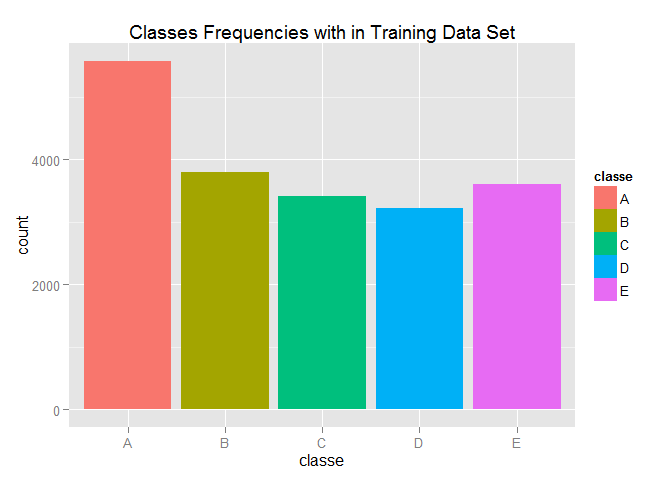
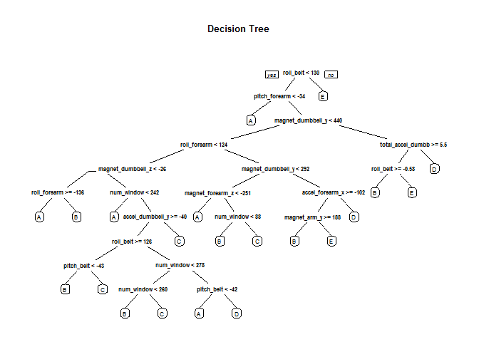

# Barbell lifts Classification - Project
Mohamed Abdelaziz Hassan Galal  
Sunday, December 27, 2015  

## Introduction 

In this project, the goal is to use data from accelerometers on the belt, forearm, arm, and dumbell of 6 participants. They were asked to perform barbell lifts correctly and incorrectly in 5 different ways. More information is available from the website here: http://groupware.les.inf.puc-rio.br/har (see the section on the Weight Lifting Exercise Dataset). 

The training data for this project are available here: 
https://d396qusza40orc.cloudfront.net/predmachlearn/pml-training.csv

The test data are available here: 
https://d396qusza40orc.cloudfront.net/predmachlearn/pml-testing.csv

The data for this project come from this source: http://groupware.les.inf.puc-rio.br/har.

# Analysis

## 1. Set the Environemnt and Load data Set of training and testing the ML model.


```r
library(AppliedPredictiveModeling)
library(caret)
```

```
## Loading required package: lattice
## Loading required package: ggplot2
```

```r
library("rpart")
library("rpart.plot")
library(randomForest)
```

```
## randomForest 4.6-12
## Type rfNews() to see new features/changes/bug fixes.
```


```r
fname.training <- "pml-training.csv"
fname.testing <- "pml-testing.csv"
if ( !file.exists(fname.training))
  {
  trainUrl <- "https://d396qusza40orc.cloudfront.net/predmachlearn/pml-training.csv"
  download.file(trainUrl,fname.training, method="auto" )  
  }
if (!file.exists(fname.testing) )
{
  testUrl  <- "https://d396qusza40orc.cloudfront.net/predmachlearn/pml-testing.csv"
  download.file(testUrl,fname.testing, method="auto" )   
}

# read data into R data frames.
df_training <- read.csv(fname.training, na.strings=c("NA","","<NA>"), header=TRUE)
cnames_train <- colnames(df_training)
df_testing <- read.csv(fname.testing, na.strings=c("NA","","<NA>"), header=TRUE)
cnames_test <- colnames(df_testing)
```

##2. Preprocessing training data.

Here we are aiming to remove NAs columns from training data sets. In order to not lose an important feature we set condition on Na ratio which greater than 50% of the training data sample.


```r
nacols<- c(1,2,3,4,5) ## X ,UserName,and Timestamps  Attributes hav no meananing with Prediction Model
training.size<- nrow (df_training)
for( i in 1 : ncol(df_training))
{
nasum<- sum(is.na(df_training[,i]))
if (nasum/training.size>.5) { nacols<- cbind( nacols, i) }
}


df_trainv2<- df_training[,-nacols] 
features_cnt<- ncol(df_trainv2)-1
df_testingv2 <- df_testing[,-nacols]
```

After removing NA columns which has NA ratio > 50% we currently have 54 features.
We will check if these features contain any Nulls to be mutated with nearest k means values, if any!


```r
sum(is.na(df_trainv2))
```

```
## [1] 0
```

```r
DataNZV <- nearZeroVar(df_trainv2, saveMetrics=TRUE)
colnames(df_trainv2)
```

```
##  [1] "new_window"           "num_window"           "roll_belt"           
##  [4] "pitch_belt"           "yaw_belt"             "total_accel_belt"    
##  [7] "gyros_belt_x"         "gyros_belt_y"         "gyros_belt_z"        
## [10] "accel_belt_x"         "accel_belt_y"         "accel_belt_z"        
## [13] "magnet_belt_x"        "magnet_belt_y"        "magnet_belt_z"       
## [16] "roll_arm"             "pitch_arm"            "yaw_arm"             
## [19] "total_accel_arm"      "gyros_arm_x"          "gyros_arm_y"         
## [22] "gyros_arm_z"          "accel_arm_x"          "accel_arm_y"         
## [25] "accel_arm_z"          "magnet_arm_x"         "magnet_arm_y"        
## [28] "magnet_arm_z"         "roll_dumbbell"        "pitch_dumbbell"      
## [31] "yaw_dumbbell"         "total_accel_dumbbell" "gyros_dumbbell_x"    
## [34] "gyros_dumbbell_y"     "gyros_dumbbell_z"     "accel_dumbbell_x"    
## [37] "accel_dumbbell_y"     "accel_dumbbell_z"     "magnet_dumbbell_x"   
## [40] "magnet_dumbbell_y"    "magnet_dumbbell_z"    "roll_forearm"        
## [43] "pitch_forearm"        "yaw_forearm"          "total_accel_forearm" 
## [46] "gyros_forearm_x"      "gyros_forearm_y"      "gyros_forearm_z"     
## [49] "accel_forearm_x"      "accel_forearm_y"      "accel_forearm_z"     
## [52] "magnet_forearm_x"     "magnet_forearm_y"     "magnet_forearm_z"    
## [55] "classe"
```

```r
df_train<- df_trainv2
```

Features we counted have no missing values. And we can check the variability of each feature using nearZeroVar analysis.

## Exploratory analysis
The variable classe contains 5 levels. The plot of the outcome variable shows the frequency of each levels in the subTraining data.


```r
g<- ggplot (df_train , aes(classe) )
g<- g + geom_bar( aes(fill=classe))
g<- g + ggtitle("Classes Frequencies with in Training Data Set" )
g
```

 

## 3. Data Partitioning


```r
subindx <- createDataPartition(y =df_train$classe, p=0.75, list=FALSE)
subTraining <- df_train[subindx, ] 
subCV <- df_train[-subindx, ]
```

** Apply Decision Tree model**


```r
FitDT <- rpart(classe ~ ., data=subTraining, method="class")

# Perform prediction
predictDT <- predict(FitDT, subCV, type = "class")
resDT= (subCV$class==predictDT ) 
# Plot result
rpart.plot(FitDT, main="Decision Tree")
```

 

```r
confusionMatrix(predictDT, subCV$classe)
```

```
## Confusion Matrix and Statistics
## 
##           Reference
## Prediction    A    B    C    D    E
##          A 1245  154   36   53   48
##          B   47  543   28   60   90
##          C   16   71  693  119   75
##          D   73  122   47  538  111
##          E   14   59   51   34  577
## 
## Overall Statistics
##                                           
##                Accuracy : 0.7333          
##                  95% CI : (0.7207, 0.7456)
##     No Information Rate : 0.2845          
##     P-Value [Acc > NIR] : < 2.2e-16       
##                                           
##                   Kappa : 0.6618          
##  Mcnemar's Test P-Value : < 2.2e-16       
## 
## Statistics by Class:
## 
##                      Class: A Class: B Class: C Class: D Class: E
## Sensitivity            0.8925   0.5722   0.8105   0.6692   0.6404
## Specificity            0.9171   0.9431   0.9306   0.9139   0.9605
## Pos Pred Value         0.8105   0.7070   0.7115   0.6038   0.7850
## Neg Pred Value         0.9555   0.9018   0.9588   0.9337   0.9223
## Prevalence             0.2845   0.1935   0.1743   0.1639   0.1837
## Detection Rate         0.2539   0.1107   0.1413   0.1097   0.1177
## Detection Prevalence   0.3132   0.1566   0.1986   0.1817   0.1499
## Balanced Accuracy      0.9048   0.7576   0.8706   0.7915   0.8005
```

Error of the predection using DT model 


```r
perDT<- table ( resDT)
errorDT <- perDT[1]/perDT[2]
perDT
```

```
## resDT
## FALSE  TRUE 
##  1308  3596
```

we get error using decision tree model is about36.3737486%.

** Apply random Forest model**


```r
FitRF <- randomForest(classe ~ ., data=subTraining, method="class")
predictRF <- predict(FitRF, subCV[,-ncol(subCV)], type = "class")
resRF= (subCV$class==predictRF ) 
confusionMatrix(predictRF, subCV$classe)
```

```
## Confusion Matrix and Statistics
## 
##           Reference
## Prediction    A    B    C    D    E
##          A 1395    1    0    0    0
##          B    0  947    2    0    0
##          C    0    1  853    3    0
##          D    0    0    0  801    3
##          E    0    0    0    0  898
## 
## Overall Statistics
##                                          
##                Accuracy : 0.998          
##                  95% CI : (0.9963, 0.999)
##     No Information Rate : 0.2845         
##     P-Value [Acc > NIR] : < 2.2e-16      
##                                          
##                   Kappa : 0.9974         
##  Mcnemar's Test P-Value : NA             
## 
## Statistics by Class:
## 
##                      Class: A Class: B Class: C Class: D Class: E
## Sensitivity            1.0000   0.9979   0.9977   0.9963   0.9967
## Specificity            0.9997   0.9995   0.9990   0.9993   1.0000
## Pos Pred Value         0.9993   0.9979   0.9953   0.9963   1.0000
## Neg Pred Value         1.0000   0.9995   0.9995   0.9993   0.9993
## Prevalence             0.2845   0.1935   0.1743   0.1639   0.1837
## Detection Rate         0.2845   0.1931   0.1739   0.1633   0.1831
## Detection Prevalence   0.2847   0.1935   0.1748   0.1639   0.1831
## Balanced Accuracy      0.9999   0.9987   0.9983   0.9978   0.9983
```

Error of the predection using random Forest model:


```r
perRF<- table ( resRF)
errorRF <- perRF[1]/perRF[2]
perRF
```

```
## resRF
## FALSE  TRUE 
##    10  4894
```

we get error using random Forest model is about0.2043318%.


## Choose Model and apply on test data set

Form above model performance we select random Forest model to be applied on test data set.


```r
df_test<- df_testingv2 
# Perform prediction on test 
predictTest <- predict(FitDT, df_test[,-ncol(df_test)], type = "class")
```

# Write the output of the prediction model

```r
result <- data.frame(cbind (df_test[,ncol(df_test)] , levels(predictTest) ),stringsAsFactors=T)
colnames(result)<- c("problem_id" , "Predicted_Calss")
write.table((result)  ,file ="AllTestCases.txt" ,row.names=FALSE )

# write file per test case on output directory
write_files = function(results){
  for(i in 1:length(results)){
    filename = paste0("submission\\problem_id_",i,".txt")
    write.table(results[i],file=filename,quote=FALSE,row.names=FALSE,col.names=FALSE)
  }
}
write_files(predictTest)
```


